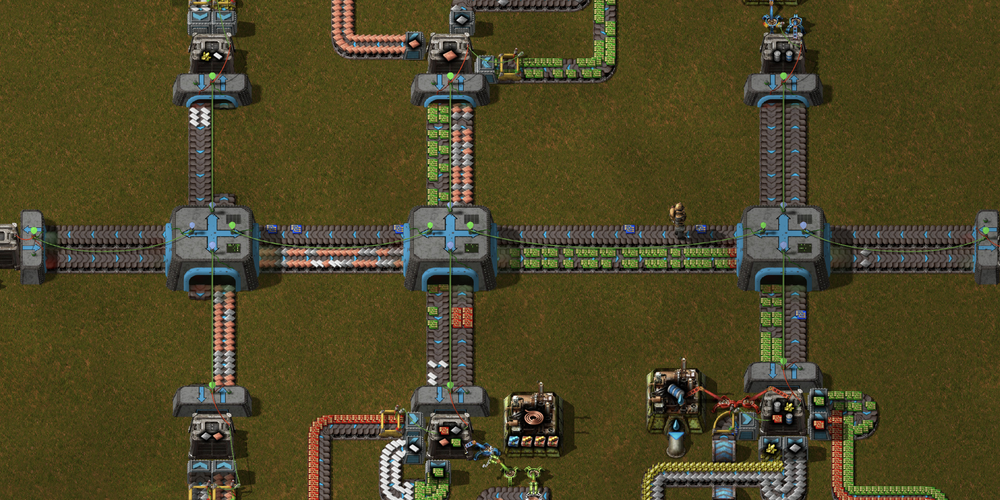

# Sushi routers

## Changes for v2.0

* Manually-controlled routers are not implemented for now.  I don't have the graphics anyway.
* Routers will now read the incoming belt contents, using the v2 "read entire belt" feature.  This means that they do not have to track the expected incoming items with combinators.
    * **However** it also means that, for now, the routers should be connected with continuous belts, and not e.g. trains or rockets.
    *  It also means your sushi belt backbone will be uglier, unless you get a mod that hides/decorates the wire reader frames.
* Internally, the routers will use loaders and a chest instead of inserters, because v2 loaders can be circuit-controlled.  Hopefully this will improve performance.
* Routers will probably be easier to jam.  Previously, one router input could jam and the others might still work, but since it will now put all inputs into a container, all inputs will typically jam together.
* Between a simpler wire protocol, not having to track incoming items, and fancier decider combinators, the router circuit will be much simpler.  Hopefully this will improve performance. 
* If you have the expansion, routers support belt stacking.  By default, the stack size is limited by the quality level of the router.

## Introduction

This mod introduces a logistic system based on "sushi" belts, meaning belts carrying a mixture of many different item types.  You can construct a network of routers and I/O points connected by belts.  The I/O points are attached to chests, and can set a request for items.  If one I/O point requests items, and another one has them in its chest, then they will sent out along the belts in the network from one chest to the other.

An early version of this mod added manually-controlled routers, where each port of the router is separately controlled by a circuit.  Currently these are unsupported, but they might come back.

## Smart routers and I/O terminals

**Might be changed from how it works / looks in v1**

The screenshot shows a simple network which uses smart routers to direct the manufacturing of blue chips.  First the green-chip station requests iron and copper; the red-chip station requests copper, plastic and green chips; the blue-chip station requests green chips, red chips, iron, sulfur and water barrels (to make sulfuric acid), and the barrel-filler station requests empty barrels.  Finally, a station at the left requests the blue chips.  All of these are routed automatically through the network.

Smart routers and I/O terminals are designed to form a network, routing items from terminals that provide them to terminals that request them.  The routers and the terminals form a network connected by green wires.  When two smart routers are connected together, their port lights will turn from red to green, and when a router port is connected to a terminal, the router's port light will turn blue.

Each terminal has a set of items it requests.  You can adjust this using the constant combinator that's integrated into the terminal, or through the circuit network.  External request signals must be connected to terminal *body* strictly by green wire.  The terminal can also set the threshold at which it starts providing items, which is useful for adjusting its priority.

Smart routers use a fancy communication protocol over the green wires.  It is recommended not to add your own signals to these.  The routers also track how many items have been from one smart router to another, so that they don't send too many.  It is therefore important not to divert these items, either with splitters or by picking them up off the belt.

Since the circuit network doesn't update instantaneously, it is possible that slightly too many of an item will be sent.  Reducing this problem is part of the purpose of the request threshold .  If extra items are sent, they would normally have nowhere to go, and so would clog up the network until someone requests them.  However, extra items can be sent to
*buffer terminals*.  Buffer terminals additionally request all types of resources that aren't requested elsewhere, by using the default signal .  Just set  on a terminal to some positive value (say, 100) and any extra items will be routed to that terminal.

I/O terminals automatically connect to adjacent chests (including logistics chests, linked chests and infinity chests, at least if those objects support connections), unless this is disabled in the map settings.  They should be connected with a red wire on the chest, connecting to the port/chest connection pole on the terminal (that's the one with the big red/green lightbulb on top).

## Balancing

Smart routers are not very balanced, because they make some types of logistics prolems significantly easier.  However, they are fairly expensive and use a lot of power.

## How it works

**being changed for v2**

## Performance cost

**being changed for v2**

## Limitations

The design of routers, and especially smart routers, has many limitations, both inherently and due to my scripting skills.  Because they are very complex compound entities, there are likely to be bugs around building, destroying and blueprinting routers.  In particular:

**Will be changed for v2**

* If you remove a router, then undoing the removal with control-Z won't restore its connections.
* If you remove a router I/O point, then undoing the removal with control-Z won't restore its connections or its trim settings (but will restore its request list).
* The feature that automatically connects router I/O points to chests triggers (when turned on in map settings) even when the router and chest were built from a blueprint where they're intentionally not connected.

## Compatibility

This mod should be compatible with:

**Will be changed for v2**
* Krastorio 2
* Space Exploration
* Pyanodon's Alternative Energy (and possibly other Py setups)
* Bob's Logistics
* SeaBlock
* Industrial Revolution 3
* Black Rubber Belts
* Picker Dollies

## TODO list

See TODO.md on the github.  Some notable todo items:

* Better graphics
* Bring manual routers back to the polish level of smart ones, and re-enable them.
* Localization to languages other than English
* Integration with 248k, EI, etc
* Test and polish interactions
* Allow manual routers to request items when negative instead of positive, in the style of LTN
* Add routers with 2 lanes in each direction?  This is even more unbalanced but probably doesn't hurt UPS much.